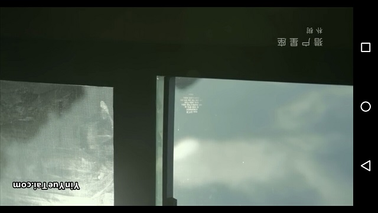
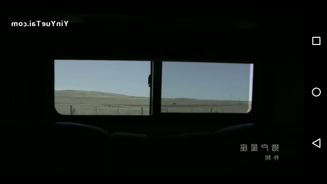
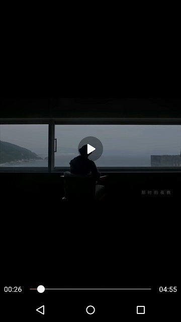

# 一天开发一个播放器Demo：PLDroidPlayer实战 #
上次对播放器ijkPlayer和PLDroidPlayer进行了[评测](https://juejin.im/post/5a1d8f10f265da431523a849)，总体来说：

1. ijkPlayer可以自己裁剪编译，灵活性较好；
2. PLDroidPlayer不能裁剪，所以不需要编译，集成简单
3. PLDroidPlayer首开速度要快
4. PLDroidPlayer在软解码条件下CPU和内存消耗较少

这次，我们和PLDroidPlayer玩耍了一下，集成了PLDroidPlayer的SDK，并且PLDroidPlayer的基础上自定义了播放器界面，整体体验如下：

1. 由于[官方文档](https://developer.qiniu.com/pili/sdk/1210/the-android-client-sdk?ref=www.qiniu.com)十分详细，所以集成SDK仅仅花费了几分钟时间，就能使用PLDroidPlayer播放视频了；
2. 集成过程中发现比较特别的功能，如DNS解析优化，本地缓存等；
3. 自定义UI界面花费时间较多，有很多细节需要处理。

## 集成SDK ##
### 下载SDK ###
PLDroidPlayer的SDK挂载在Github:[https://github.com/pili-engineering/PLDroidPlayer/releases](https://github.com/pili-engineering/PLDroidPlayer/releases)，我们选择最新SDK下载。希望官方能够提供Gradle依赖，这样会方便很多。
### 导入SDK ###
下载下来的SDK提供了几种CPU类型的so库，这里为了减少apk的体积，只选择armeabi和armeabi-v7a的库。然后将jar包导入到项libs目录下，导入结果如下图：

导入完成后，记得同步一下，这样就能调用SDK里面的API了。

### 清单文件配置 ###
在清单文件中添加4个权限：

	<uses-permission android:name="android.permission.INTERNET" />
	<uses-permission android:name="android.permission.READ_EXTERNAL_STORAGE" />
	<uses-permission android:name="android.permission.WAKE_LOCK" />
	<uses-permission android:name="android.permission.ACCESS_NETWORK_STATE"/>

1. 网络权限
2. 读取外部磁盘权限：在需要缓存视频文件时需要（在6.0以上版本需要动态申请）
3. 唤醒锁权限：播放视频控制不黑屏使用
4. 获取网络状态权限：在需要判断网络连接状态时使用

### 代码混淆配置 ###
如果打包apk开启了代码混淆，还需要配置一下proguard-rules.pro文件，防止SDK的类被混淆掉。

	-keep class com.pili.pldroid.player.** { *; }
	-keep class com.qiniu.qplayer.mediaEngine.MediaPlayer{*;}

## PLVideoView使用 ##

PLVideoView使用SurfaceView作为视频的渲染层。
### 布局 ###
在布局中添加PLVideoView，并添加一个ProgressBar作为PLVideoView加载视频的进度条。PLVideoView在布局文件中配置属性keepScreenOn为true，让屏幕保持常亮。当然，我们也可以使用相关API完成屏幕的点亮与熄灭。

	<?xml version="1.0" encoding="utf-8"?>
	<FrameLayout xmlns:android="http://schemas.android.com/apk/res/android"
	             android:layout_width="match_parent"
	             android:layout_height="match_parent"
	    android:background="@android:color/black">
	
	    <com.pili.pldroid.player.widget.PLVideoView
	        android:id="@+id/pl_video_view"
	        android:layout_width="match_parent"
	        android:layout_height="wrap_content"
	        android:layout_gravity="center"
	        android:keepScreenOn="true">
	    </com.pili.pldroid.player.widget.PLVideoView>
	
	    <ProgressBar
	        android:id="@+id/progress_bar"
	        android:layout_width="wrap_content"
	        android:layout_height="wrap_content"
	        android:layout_gravity="center"/>
	</FrameLayout>

### 初始化 ###
我们可以调用PLVideoView的API进行初始化设置，如视频路径，各种播放监听器，MediaController(如图所示),视频预览模式（原始尺寸、适应屏幕、全屏铺满、16:9、4:3）等。

    @Override
    protected void onCreate(@Nullable Bundle savedInstanceState) {
        super.onCreate(savedInstanceState);
        setContentView(R.layout.activity_pl_video_view);

        mPlVideoView = findViewById(R.id.pl_video_view);
        String path = "http://hc.yinyuetai.com/uploads/videos/common/2B40015FD4683805AAD2D7D35A80F606.mp4?sc=364e86c8a7f42de3&br=783&rd=Android";
        //设置Video的路径
		mPlVideoView.setVideoPath(path);
        //设置MediaController，这里是拷贝官方Demo的MediaController，当然可以自己实现一个
        mPlVideoView.setMediaController(new MediaController(this));
        //设置视频预览模式
        mPlVideoView.setDisplayAspectRatio(PLVideoView.ASPECT_RATIO_PAVED_PARENT);
		//设置加载进度的布局
        mPlVideoView.setBufferingIndicator(findViewById(R.id.progress_bar));

    }

### 生命周期管理 ###

    @Override
    protected void onResume() {
        super.onResume();
        mPlVideoView.start();//开始播放
    }

    @Override
    protected void onPause() {
        super.onPause();
        mPlVideoView.pause();//暂停播放
    }

    @Override
    protected void onDestroy() {
        super.onDestroy();
        mPlVideoView.stopPlayback();//释放资源
    }

### 横竖屏切换 ###
当横竖屏切换时，为了不让Activity重新创建，我们需要配置AndroidManifest.xml。

    <activity
        android:name=".PLVideoViewActivity"
        android:configChanges="orientation|screenSize|keyboardHidden"
        android:theme="@style/AppTheme.FullScreen"/>

## PLVideoTextureView ##
PLVideoTextureView与PLVideoView的API几乎一模一样，由于PLVideoTextureView内部使用TextureView作为视频渲染控件，所以它还具备旋转、镜像变换的功能。

	mPlVideoView.setRotation(180);

	mPlVideoView.setMirror(true);

## 自定义UI ##

PLDroidPlayer只提供比较简单的播放控件PLVideoView和PLVideoTextureView，这可能还不能完全满足项目需求，一般还需要自己定义一套播放UI界面。这里，我们自定义一个组合式控件VideoView，它的内部包含最基本的播放控件，还有加载进度条，播放进度条，播放时间，播放暂停按钮。当然如果想要做的更完美一些，还可以加一些手势进行音量、亮度等控制。

### 配置进度条样式 ###

    <ProgressBar
        android:id="@+id/progress_bar"
        android:layout_width="wrap_content"
        android:layout_height="wrap_content"
        android:indeterminateDrawable="@drawable/loading"
        android:layout_gravity="center"/>
在ProgressBar里面配置一个indeterminateDrawable属性，指定为drawable文件loading。

	<rotate xmlns:android="http://schemas.android.com/apk/res/android"
	    android:drawable="@drawable/loading_bg"
	    android:fromDegrees="0.0"
	    android:pivotX="50.0%"
	    android:pivotY="50.0%"
	    android:toDegrees="360.0" />
而loading文件是一个roate的动画，里面配置360度选旋转一张图片。

### 播放暂停按钮 ###
在VideoView中间放置一个播放暂停按钮，默认是隐藏的，当开始播放时显示成暂停的按钮，等待5s后自动隐藏，当用户触摸VideoView时又显示出来，松开之后延时5s又隐藏掉。

	//视频准备监听器
    private PLMediaPlayer.OnPreparedListener mOnPreparedListener = new PLMediaPlayer.OnPreparedListener() {
        @Override
        public void onPrepared(PLMediaPlayer plMediaPlayer, int i) {
			//显示播放按钮
            mPlay.setVisibility(View.VISIBLE);
			//开始延时5s
            postDelayed(mHider, HIDE_DELAY);
        }
    };

	//延时5s后执行该Runnable
    private Runnable mHider = new Runnable() {
        @Override
        public void run() {
 			//隐藏播放按钮
            mPlay.setVisibility(View.GONE);
        }
    };

	//处理触摸事件
    @Override
    public boolean onTouchEvent(MotionEvent event) {
        switch (event.getAction()) {
            case MotionEvent.ACTION_DOWN:
                if (mProgressBar.getVisibility() == View.GONE) {
                    //显示播放器
                    mPlay.setVisibility(VISIBLE);
					//延时5s隐藏
                    postDelayed(mHider, HIDE_DELAY);
                }
                break;
        }
        return super.onTouchEvent(event);
    }

	//处理播放暂停按钮点击事件
    private void togglePlay() {
        if (mTextureView.isPlaying()) {
            mTextureView.pause();//暂停
            mPlay.setImageResource(R.drawable.play_selector);
            removeCallbacksAndMessages(null);//清空消息循环

        } else {
            mTextureView.start();//播放
            mPlay.setVisibility(View.GONE);
            mPlay.setImageResource(R.drawable.pause_selector);
        }
    }

### 播放进度 ###
当视频准备好开始播放时，我们更新播放总时长，然后开启一个消息循环，每隔一段时间更新已播放时长。

    private PLMediaPlayer.OnPreparedListener mOnPreparedListener = new PLMediaPlayer.OnPreparedListener() {
        @Override
        public void onPrepared(PLMediaPlayer plMediaPlayer, int i) {

            mProgressBar.setVisibility(View.GONE);

            long duration = mTextureView.getDuration();
			//格式化总时间长并更新
            mDuration.setText(TimeUtils.stringForTime(duration));
			//设置SeekBar进度
            mSeekBar.setMax((int) duration);
			//开始消息循环，更新已播放时长
            postDelayed(mTicker, DELAY);
        }
    };

    private Runnable mTicker = new Runnable() {

        @Override
        public void run() {
			//更新已播放时长
            mCurrentTime.setText(TimeUtils.stringForTime(mTextureView.getCurrentPosition()));
			//更新SeekBar进度
            mSeekBar.setProgress((int) mTextureView.getCurrentPosition());
			//延时再次刷新
            postDelayed(mTicker, DELAY);
        }
    };

当用户暂停播放时停止消息循环，开始播放时，重新开启消息循环。

    private void togglePlay() {
        if (mTextureView.isPlaying()) {
			//移除消息队列里面的mTicker，停止消息循环
            removeCallbacks(mTicker);
        } else {
			//重启消息循环
            postDelayed(mTicker, DELAY);
        }
    }

### 拖动进度条处理 ###
    private SeekBar.OnSeekBarChangeListener mOnSeekBarChangeListener = new SeekBar.OnSeekBarChangeListener() {
        @Override
        public void onProgressChanged(SeekBar seekBar, int progress, boolean fromUser) {
			//如果是用户操作
            if (fromUser) {
				//设置播放进度
                mTextureView.seekTo(progress);
            }
        }
    };

### 播放结束处理 ###
播放结束时，重置播放按钮图片，重置已播放时长，停止定时更新进度

    private PLMediaPlayer.OnCompletionListener mOnCompletionListener = new PLMediaPlayer.OnCompletionListener() {
        @Override
        public void onCompletion(PLMediaPlayer plMediaPlayer) {
            mPlay.setImageResource(R.drawable.play_selector);
            mCurrentTime.setText("00:00");
            removeCallbacks(mTicker);
        }
    };

### 意外退出处理 ###
当用户在播放过程中直接退出Activity时，我们在onDetachedFromWindow中做一些清理工作。

    @Override
    protected void onDetachedFromWindow() {
        super.onDetachedFromWindow();
        mTextureView.stopPlayback();//停止播放
        removeCallbacks(mTicker);//移除定时更新进度
        removeCallbacks(mHider);//移除定时隐藏
    }

## 小结 ##
事实上，如果对播放器的内核没有特殊自定义需求，直接使用PLDroidPlayer是个不错的选择，集成简单，节省不少时间成本，并且性能不错。当然对于PLDroidPlayer也有一些不足的地方：

1. 没有提供Gradle依赖来下载SDK相关文件，需要自己去Github下载。
2. 其实PLDroidPlayer还可以提供一套可默认的UI层的库，这样开发者如果对UI没有定制化需求，那么简直不要太简单。
3. 在使用过程中还存在一些小Bug，比如会出现已播放时长超过视频总时长的情况，不知道是不是我的使用姿势问题还是SDK的问题。
4. 我还尝试过将PLDroidPlayer放在列表中想做一个类似今日头条的视频列表效果，但并不成功，不知道是不是我的姿势问题还是SDK没有考虑过这方面的需求。
