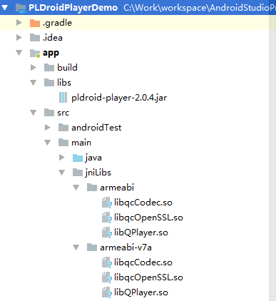

# PLDroidPlayer使用教程 #
[官方文档](https://developer.qiniu.com/pili/sdk/1210/the-android-client-sdk?ref=www.qiniu.com)

## 集成SDK ##
### 下载SDK ###
PLDroidPlayer的SDK挂载在Github:[https://github.com/pili-engineering/PLDroidPlayer/releases](https://github.com/pili-engineering/PLDroidPlayer/releases)，我们选择最新SDK下载。希望官方能够提供Gradle依赖，这样会方便很多。
### 导入SDK ###
下载下来的SDK提供了几种CPU类型的so库，这里为了减少apk的体积，只选择armeabi和armeabi-v7a的库。然后将jar包导入到项libs目录下，导入结果如下图：

导入完成后，记得同步一下，这样就能调用SDK里面的API了。

### 清单文件配置 ###
在清单文件中添加4个权限：

	<uses-permission android:name="android.permission.INTERNET" />
	<uses-permission android:name="android.permission.READ_EXTERNAL_STORAGE" />
	<uses-permission android:name="android.permission.WAKE_LOCK" />
	<uses-permission android:name="android.permission.ACCESS_NETWORK_STATE"/>

1. 网络权限
2. 读取外部磁盘权限：在需要缓存视频文件时需要（在6.0以上版本需要动态申请）
3. 唤醒锁权限：播放视频控制不黑屏使用
4. 获取网络状态权限：在需要判断网络连接状态时使用

### 代码混淆配置 ###
如果打包apk开启了代码混淆，还需要配置一下proguard-rules.pro文件，防止SDK的类被混淆掉。

	-keep class com.pili.pldroid.player.** { *; }
	-keep class com.qiniu.qplayer.mediaEngine.MediaPlayer{*;}

