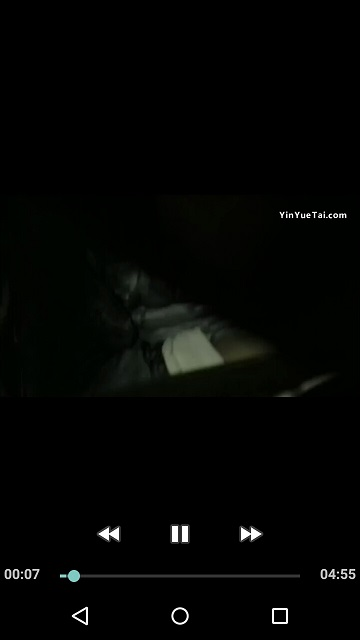
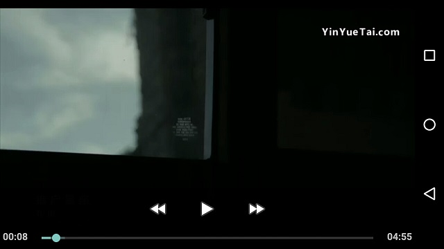

# PLDroidPlayer使用教程 #
[官方文档](https://developer.qiniu.com/pili/sdk/1210/the-android-client-sdk?ref=www.qiniu.com)

## 集成SDK ##
### 下载SDK ###
PLDroidPlayer的SDK挂载在Github:[https://github.com/pili-engineering/PLDroidPlayer/releases](https://github.com/pili-engineering/PLDroidPlayer/releases)，我们选择最新SDK下载。希望官方能够提供Gradle依赖，这样会方便很多。
### 导入SDK ###
下载下来的SDK提供了几种CPU类型的so库，这里为了减少apk的体积，只选择armeabi和armeabi-v7a的库。然后将jar包导入到项libs目录下，导入结果如下图：

导入完成后，记得同步一下，这样就能调用SDK里面的API了。

### 清单文件配置 ###
在清单文件中添加4个权限：

	<uses-permission android:name="android.permission.INTERNET" />
	<uses-permission android:name="android.permission.READ_EXTERNAL_STORAGE" />
	<uses-permission android:name="android.permission.WAKE_LOCK" />
	<uses-permission android:name="android.permission.ACCESS_NETWORK_STATE"/>

1. 网络权限
2. 读取外部磁盘权限：在需要缓存视频文件时需要（在6.0以上版本需要动态申请）
3. 唤醒锁权限：播放视频控制不黑屏使用
4. 获取网络状态权限：在需要判断网络连接状态时使用

### 代码混淆配置 ###
如果打包apk开启了代码混淆，还需要配置一下proguard-rules.pro文件，防止SDK的类被混淆掉。

	-keep class com.pili.pldroid.player.** { *; }
	-keep class com.qiniu.qplayer.mediaEngine.MediaPlayer{*;}

## PLVideoView使用 ##

PLVideoView使用SurfaceView作为视频的渲染层，所以不具备旋转，滚动等移动操作。
### 布局 ###
在布局中添加PLVideoView，并添加一个ProgressBar作为PLVideoView加载视频的进度条。PLVideoView在布局文件中配置属性keepScreenOn为true，让屏幕保持常亮。当然，我们也可以使用相关API完成屏幕的点亮与熄灭。

	<?xml version="1.0" encoding="utf-8"?>
	<FrameLayout xmlns:android="http://schemas.android.com/apk/res/android"
	             android:layout_width="match_parent"
	             android:layout_height="match_parent"
	    android:background="@android:color/black">
	
	    <com.pili.pldroid.player.widget.PLVideoView
	        android:id="@+id/pl_video_view"
	        android:layout_width="match_parent"
	        android:layout_height="wrap_content"
	        android:layout_gravity="center"
	        android:keepScreenOn="true">
	    </com.pili.pldroid.player.widget.PLVideoView>
	
	    <ProgressBar
	        android:id="@+id/progress_bar"
	        android:layout_width="wrap_content"
	        android:layout_height="wrap_content"
	        android:layout_gravity="center"/>
	</FrameLayout>

### 初始化 ###
我们可以调用PLVideoView的API进行初始化设置，如视频路径，各种播放监听器，MediaController(如图所示),视频预览模式（原始尺寸、适应屏幕、全屏铺满、16:9、4:3）等。

    @Override
    protected void onCreate(@Nullable Bundle savedInstanceState) {
        super.onCreate(savedInstanceState);
        setContentView(R.layout.activity_pl_video_view);

        mPlVideoView = findViewById(R.id.pl_video_view);
        String path = "http://hc.yinyuetai.com/uploads/videos/common/2B40015FD4683805AAD2D7D35A80F606.mp4?sc=364e86c8a7f42de3&br=783&rd=Android";
        //设置Video的路径
		mPlVideoView.setVideoPath(path);
        //设置MediaController，这里是拷贝官方Demo的MediaController，当然可以自己实现一个
        mPlVideoView.setMediaController(new MediaController(this));
        //设置视频预览模式
        mPlVideoView.setDisplayAspectRatio(PLVideoView.ASPECT_RATIO_PAVED_PARENT);
		//设置加载进度的布局
        mPlVideoView.setBufferingIndicator(findViewById(R.id.progress_bar));

    }

### 生命周期管理 ###

    @Override
    protected void onResume() {
        super.onResume();
        mPlVideoView.start();//开始播放
    }

    @Override
    protected void onPause() {
        super.onPause();
        mPlVideoView.pause();//暂停播放
    }

    @Override
    protected void onDestroy() {
        super.onDestroy();
        mPlVideoView.stopPlayback();//释放资源
    }

### 横竖屏切换 ###
当横竖屏切换时，为了不让Activity重新创建，我们需要配置AndroidManifest.xml。

    <activity
        android:name=".PLVideoViewActivity"
        android:configChanges="orientation|screenSize|keyboardHidden"
        android:theme="@style/AppTheme.FullScreen"/>
